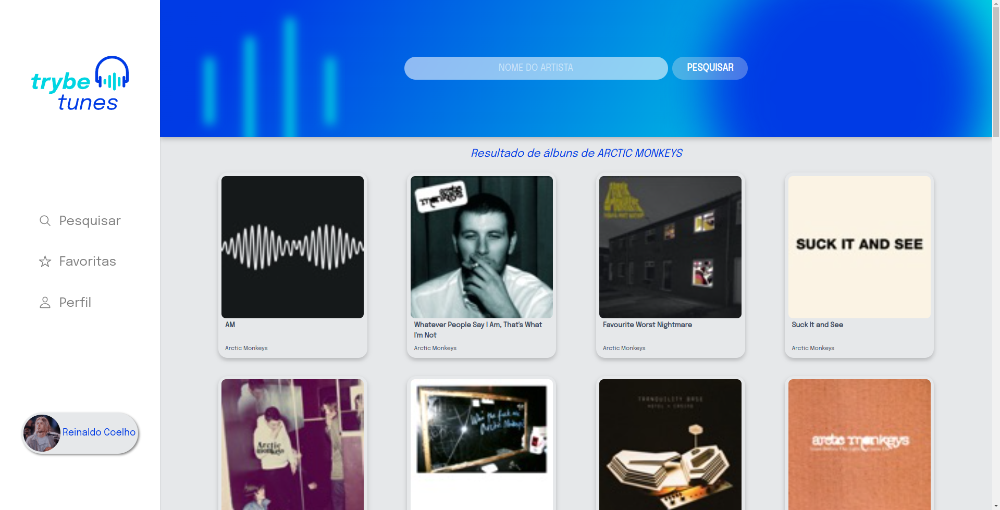
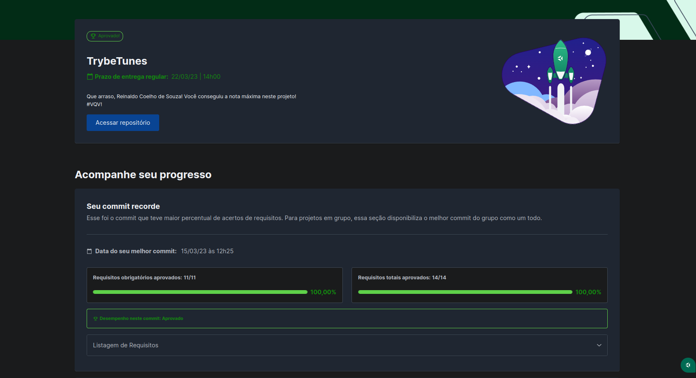

# 🎧 Trybetunes

## 📘 Sobre

Uma aplicação em que consumo a API do iTunes e renderizo alguns elementos na tela usando React.js.

## 🧩 Funcionalidades

- Logar na aplicação através de um nome de usuário;
- Pesquisar por uma banda ou artista;
- Visualizar os albums disponíveis;
- Acessar as músicas de determinado album;
- Ouvir uma prévia da música;
- Adicionar uma música aos favoritos;
- Acessar suas músicas favoritas;
- Editar seu perfil.

Acesse [aqui](https://coelhoreinaldo.github.io/trybetunes).

## ⚛️ Ferramentas

Projeto construído utilizando React.js.

- React Router;
- Requisição de API em React;
- States;
- Props;
- Forms em React;
- Metodologia TDD (Test Driven Development).
- Mobile First;

## 🛠️ Como executar o projeto?

1. Instalando dependências

`npm install`

2. Executando a aplicação

`npm start`

## 📝 Nota

## ©️ Copyright

- Logo "Trybetunes" - Direitos reservados à Trybe.
